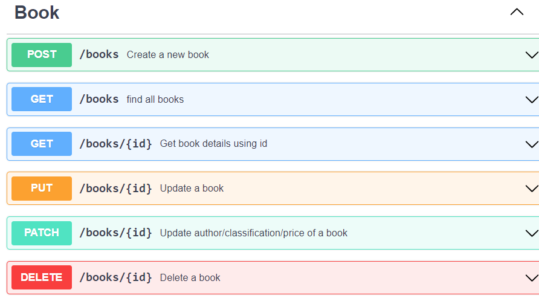
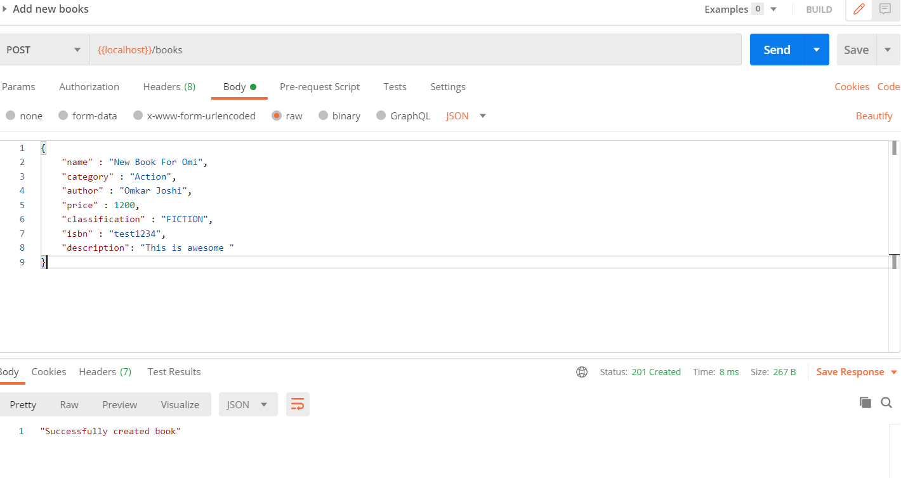
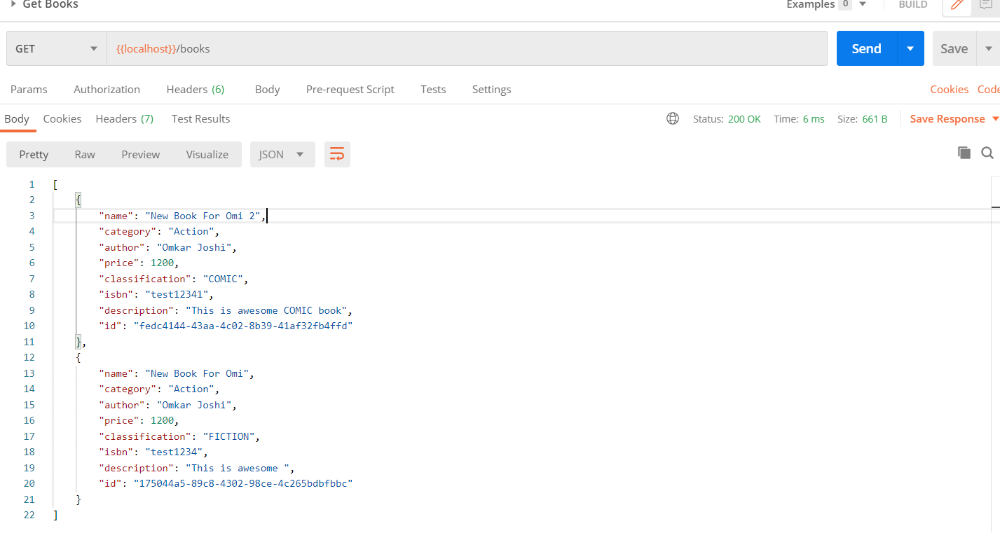
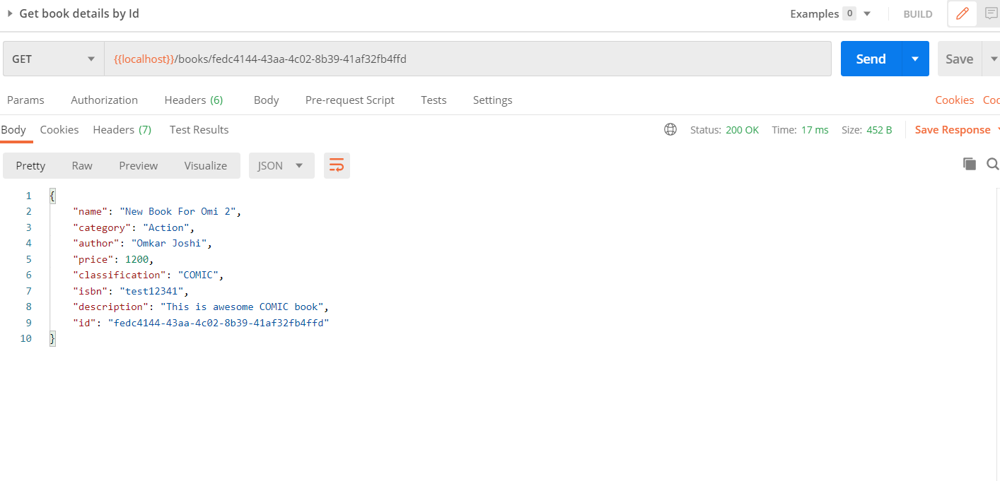
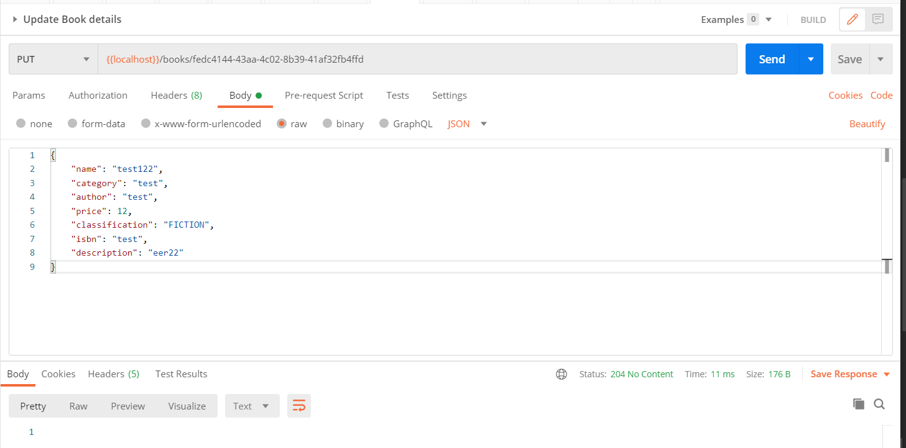
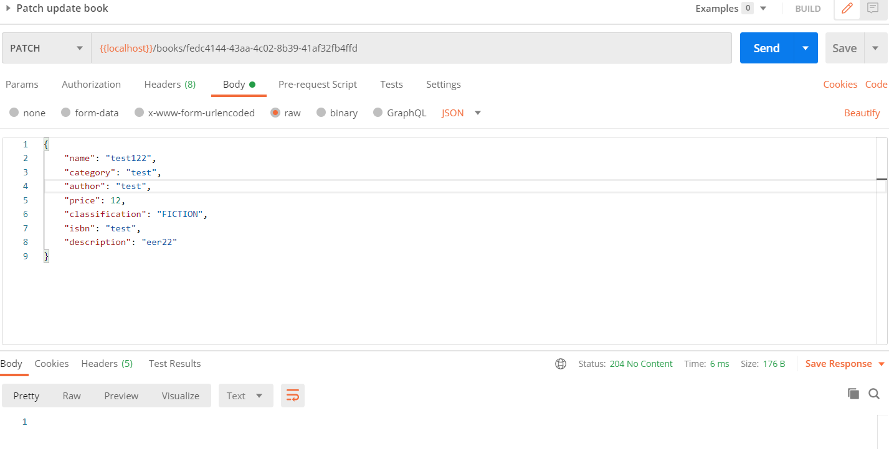
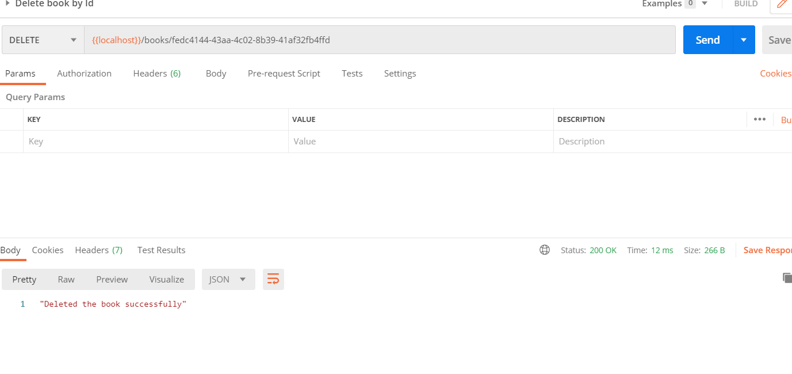

# Books REST API with Node JS and Express



## Introduction
This is a code for Book Store Assessment API

## Software Requirements

- Node.js **8+**
- Database is not integrated to make application work without any other dependency

## How to install

### Using Git (recommended)

Clone the project from github.


### Install npm dependencies after installing

```bash
npm install
```


## How to run

### Running API server locally

```bash
nodemon index.js
```


## Sample Output

### Create New Book



### Get All Books



### Get Book By {id}




### Update Book Details By {id}




### Patch Book Details By {id}



### Delete Book By {id}


